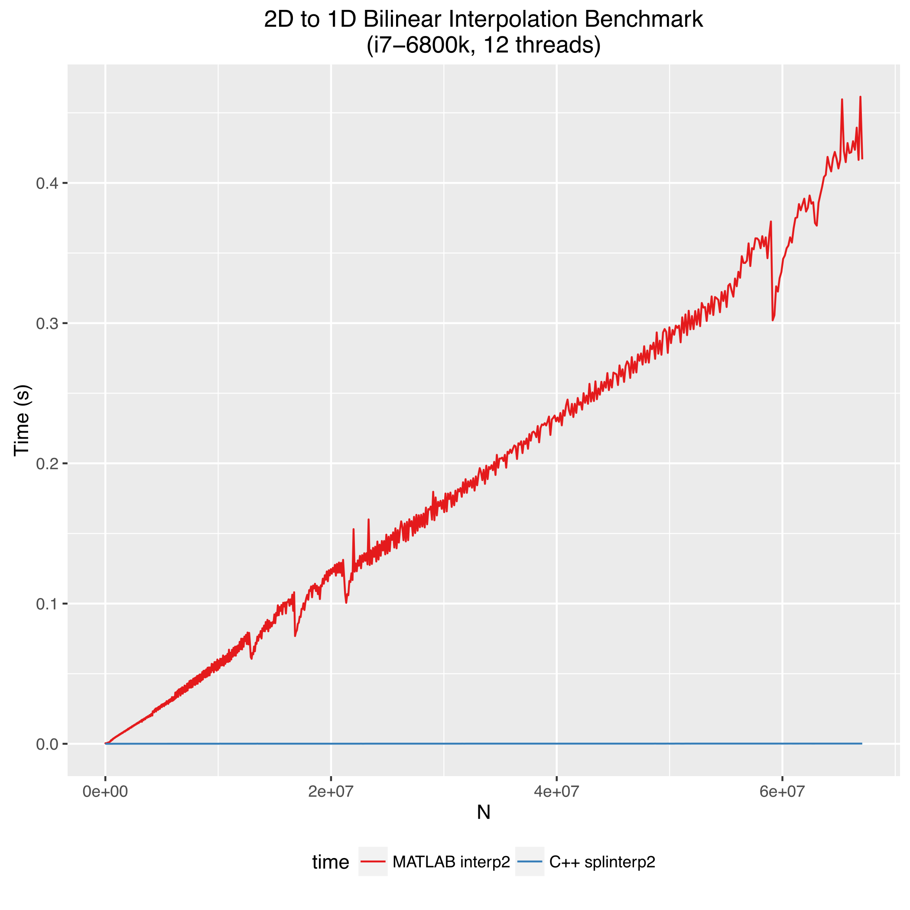
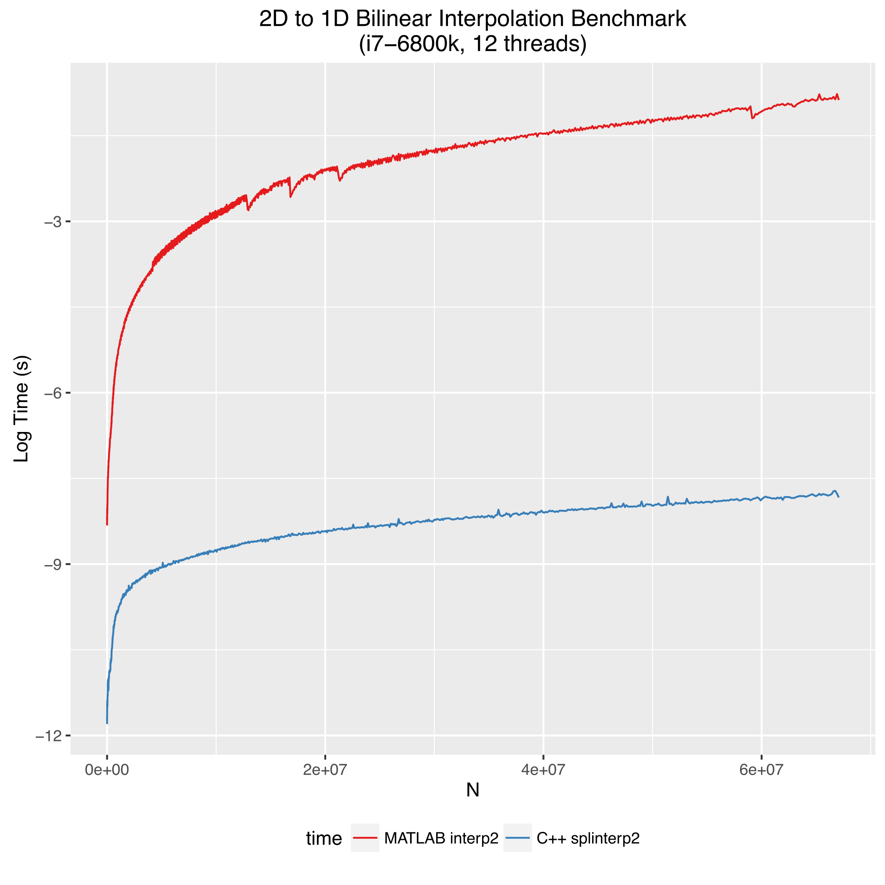
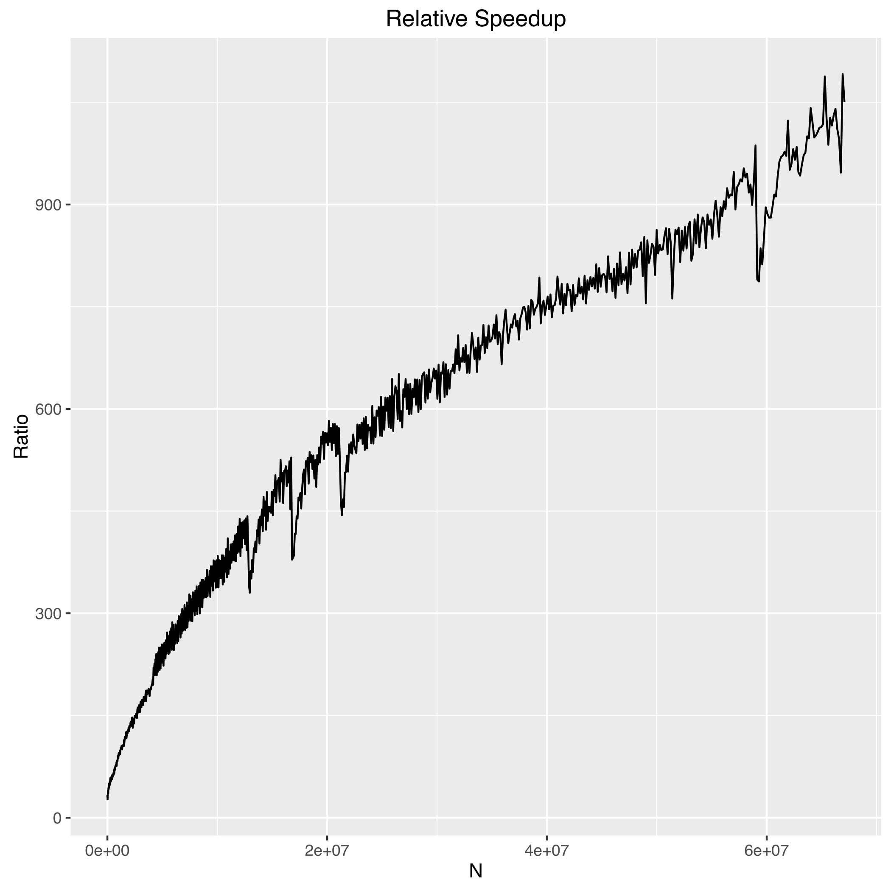

# splinter
Splinter is a fast C++ template library for parallel calculation of linear, bilinear, and trilinear interpolation from data sampled on an integer grid. Splinter also contains MEX extension files that allow its routines to be called from MATLAB/Octave. A blog post about creating splinter can be found [here](http://alanpryorjr.com/image/splinter/).

### Usage
Splinter (Strided Parallel Linear INTERpolation) consists of a single header file, `splinter.h`, which contains a number of different functions for various types of linear interpolation. Each interpolation function name is of the form `interp#[\_cx][\_F]` where # is either 1,2, or 3, indicating linear, bilinear, or trilinear interpolation, respectively. The addition of "`_cx`" indicates that it is intended for complex-valued inputs. The addition of `_F` indicate the arrays are assumed to be in column-major (Fortran) order. (TODO: implement C-style versions for row-major arrays). There are also a number of helper functions for running interpolation schemes in parallel, and the number of threads used is determined by the NUM_THREADS macro. To use a different number of threads, either edit this value in `splinter.h` and recompile, or alternatively you can define the value with the -D flag for g++. For example a simple test program
~~~ c++
// test.cpp
#include "splinter.h"

int main(){
...
...
return 0;
}
~~~

can be compiled to use splinter with 16 threads with a command like so  

`g++ test.cpp -I /path/to/splinter/ -D NUM_THREADS=12`

### Options
Two options can currently be adjusted in splinter, both are defined as macros at the top of `splinter.h` and can either be set by editing this file and recompiling or alternatively at compilation time with the -D flag. `NUM_THREADS` is the number of threads that will be spawned by the multithreaded routines. It is recommended that you do not set this value higher than twice the number of cores you have, as running more threads will just incur unnecessary overhead. `SERIAL_LIMIT` is the number of elements for parameter `N` below which only a single thread will be launched. Depending upon your hardware and OS, you may get better performance by adjusting one or both of these parameters, but the basic tradeoff is that as long as there is enough work to do to justify the overhead time of spawning the threads then completing the job concurrently should be faster.

### Conventions
The XYZ axes map to the common ijk scheme in linear algebra such that the x-direction runs along the rows, y along the columns, and z along the depth. Complex arrays are to be provided as two separate arrays, one representing the real part and another representing imaginary, rather than interleaved complex format such as in `std::complex`. Similarly, complex results are stored as separate real and imaginary parts.

### Parameters
All function parameters for the lower-dimensional routines are a subset of those for the higher equivalents. Therefore, we choose to document all possible parameters here just once.

T is template placeholder for the type, which in practice is usually double or float
  - const T* const data -> pointer to real data, potentially multidimensional
  - const T* const data_r -> pointer to real part of complex data, potentially multidimensional
  - const T* const data_i -> pointer to imaginary part of complex data, potentially multidimensional
  - const size_t& nrows -> number of rows in Nd array. This is the size along the x-direction
  - const size_t& ncols -> number of columns in Nd array. This is the size along the y-direction 
  - const size_t& nlayers -> number of layers in Nd array. This is the size along the z-direction 
  - const T* const x -> x coordinates of locations to interpolate
  - const T* const y -> y coordinates of locations to interpolate
  - const T* const z -> z coordinates of locations to interpolate
  - const size_t& N -> number of datapoints to calculate
  - T* result -> array to store the result of real interpolation
  - T* result_r -> array to store the real part of the result for complex interpolation 
  - T* result_i -> array to store the imaginary part of the result for complex interpolation 
  - const long long& origin_offset -> inputted coordinates will be shifted by this amount to establish 0-based indices, which is useful if splinter is being called from a language like MATLAB that uses 1-based indexing. See MEX functions for examples
  
### Calling splinter from MATLAB
Splinter provides MEX functions splinterp1, splinterp2, and splinterp3 that can be used as a drop-in replacement for MATLAB's interp1, interp2, and interp3 methods with potentially significant performance improvements. For example, the following call

`Vq = interp2(V,Xq,Yq)`

can be replaced by

`Vq = splinterp2(V,Xq,Yq)`

**Note that splinter assumes the coordinates of the data are an integer grid and thus does not support the X, Y, Z parameters to the MATLAB equivalents.** Therefore, only the following function calls are supported: 

`Vq = splinterp1(V1,Xq)`  

`Vq = splinterp2(V2,Xq,Yq)`  

`Vq = splinterp3(V3,Xq,Yq,Zq)`  

Where `V1`,`V2`, and `V3` are 1,2, and 3D arrays, respectively.  

To use these functions, simply download the code and compile by running `compile_mex_script.m`. If you receive a "MEX completed successfully", then the splinterp functions are now accessible from within MATLAB (you may need to add the directory where they exist to your path). If you have not used MEX before, you may need to run `mex -setup` first to configure your C compiler. More information can be foud [here](https://www.mathworks.com/help/matlab/ref/mex.html) if you run into trouble.

### Benchmarks

